# Process flows

## Functional errors

It should be noted that the following messages are used to report functional errors:

- Rejection from Office of Departure (IE056: E_DEP_REJ);
- Rejection from Office of Destination (IE057: E_DES_REJ).

A functional error occurs in the following circumstances:

- missing required data from an IE message
- IE message completed incorrectly
- missing data group(s)
- data item(s) violates a code list
- out of sequence message(s).

## Pre-lodgement message flows

### Transit presentation notification valid 

**Applicable procedures:** normal and simplified.

This scenario involves the submission of a valid transit declaration for goods that have not yet been presented to the office of departure.

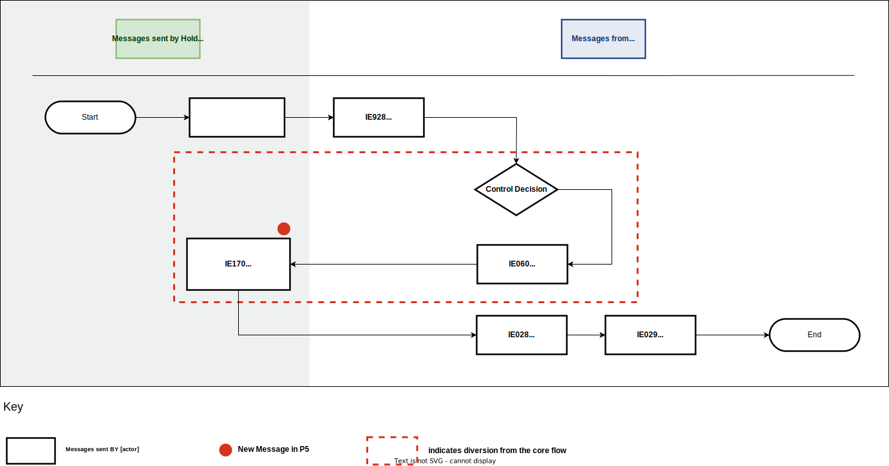

<a href="../figures/trans_pres_notif_valid.svg" target="_blank">Open the diagram in a new tab.</a>

1. The process starts when the holder of the transit procedure submits the ‘Declaration Data’ E_DEC_DAT (IE015) message to the office of departure with ‘Additional Declaration Type’ equal to ‘D’.
1. The office of departure validates this message successfully and sends the ‘Positive Acknowledgement’ E_POS_ACK (IE928) message to the holder of the transit procedure to acknowledge receipt of the transit declaration.
1. Following the result of the risk analysis engine, the office of departure may select the pre-lodged declaration for potential control of the goods prior to their presentation. The following control decisions are possible: 
    - **Yes** (apply control): the office of departure notifies the holder of the transit procedure (provided that they are an Authorised Economic Operator (AEO)) about the intention to potentially control the goods, via the ‘Control Decision Notification’ E_CTR_DEC (IE060) message (having the data element TRANSIT OPERATION-Notification type equal to ‘2-Intention to Control’). Go to step 4.
    - **No** (no control): Go to step 4.
1. The office of departure receives a valid ‘Presentation Notification for the Pre-Lodged Declaration’ E_PRE_NOT (IE170) message from the holder of the transit procedure.
1. The MRN is communicated to the holder of the transit procedure with message ‘MRN Allocated’ E_MRN_ALL (IE028).
1. The ‘Release for Transit’ E_REL_TRA (IE029) message is sent to the holder of the transit procedure.
1. The departure process ends.

### Transit presentation notification not valid 

**Applicable procedures:** normal and simplified.

This scenario involves the submission of an invalid transit declaration for goods that have not yet been presented to the office of departure.

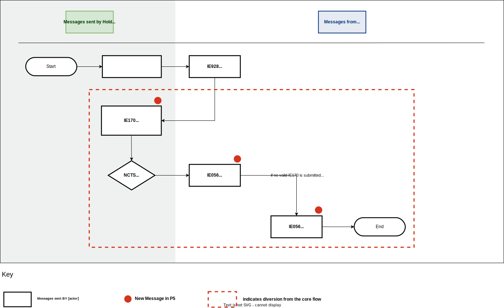

<a href="../figures/trans_pres_notif_not_valid.svg" target="_blank">Open the diagram in a new tab.</a>

1. The process starts when the holder of the transit procedure submits the ‘Declaration Data’ E_DEC_DAT (IE015) message to the office of departure with ‘Additional Declaration Type’ equal to ‘D’.
1. The office of departure validates this message successfully and sends the ‘Positive Acknowledgement’ E_POS_ACK (IE928) message to the holder of the transit procedure to acknowledge receipt of the transit declaration.
1. The office of departure receives an invalid ‘Presentation Notification for the Pre-Lodged Declaration’ E_PRE_NOT (IE170) message from the holder of the transit procedure.
1. The office of departure decides to reject the E_PRE_NOT (IE170) message. 
1. The office of departure notifies the holder of the transit procedure with the ‘Rejection from Office of Departure’ E_DEP_REJ (IE056) message.
1. If the time limit expires without the holder of the transit procedure resending a valid ‘Presentation Notification for the Pre-Lodged Declaration’ E_PRE_NOT (IE170) message, the holder of the transit procedure is notified with the message ‘Rejection from Office of Departure’ E_DEP_REJ (IE056) by the office of departure.
1. The transit movement ends.

### Corrections of the pre-lodgement declaration prior to presentation of the goods 

**Applicable procedures:** normal and simplified.

This scenario involves the holder of the transit procedure making corrections to the transit declaration prior to presentation of the goods.

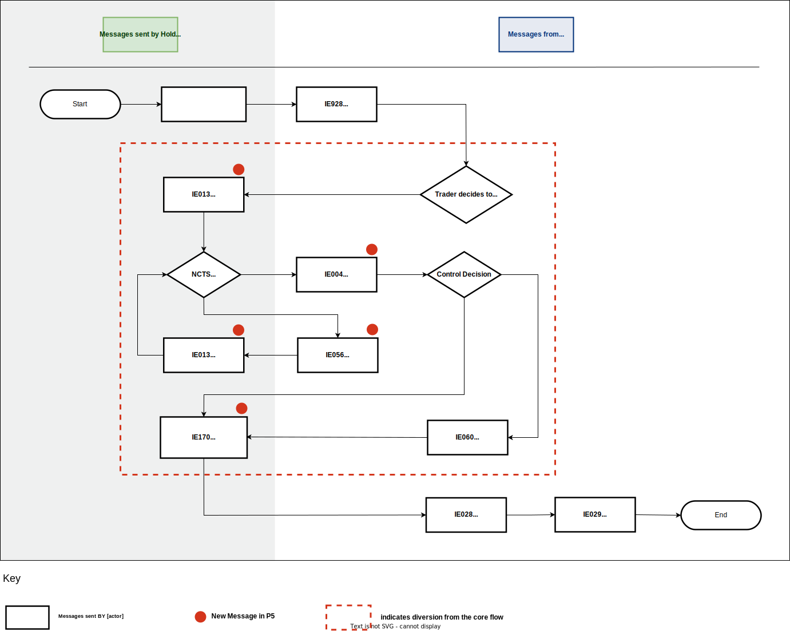

<a href="../figures/correct_pre-lodge_dec_prior_pres_goods.svg" target="_blank">Open the diagram in a new tab.</a>

1. The process starts when the holder of the transit procedure submits the ‘Declaration Data’ E_DEC_DAT (IE015) message to the office of departure with ‘Additional Declaration Type’ equal to ‘D’.
1. The office of departure validates this message successfully and sends the ‘Positive Acknowledgement’ E_POS_ACK (IE928) message to the holder of the transit procedure to acknowledge receipt of the transit declaration.
1. The holder of the transit procedure decides to correct the transit declaration and submits the ‘Declaration Amendment’ E_DEC_AMD (IE013) message.
1. The office of departure performs validation of the IE013 message with one of the following outcomes:
    - **No** (IE013 not valid): The office of departure sends the ‘Rejection from Office of Departure’ E_DEP_REJ (IE056) to the holder of the transit procedure. Go to step 3.
    - **Yes** (IE013 is valid): The office of departure sends its acceptance to the holder of the transit procedure with the ‘Amendment Acceptance’ E_AMD_ACC (IE004) message. Go to step 5.
1. Following the result of the Risk Analysis engine, the office of departure may select the pre-lodged declaration for potential control of the goods prior to their presentation. The following outcomes are possible: 
    - **Yes** (apply control): The office of departure notifies the holder of the transit procedure (provided that they are an AEO) about the intention to potentially control the goods, via the ‘Control Decision Notification’ E_CTR_DEC (IE060) message (having the data element TRANSIT OPERATION-Notification type equal to ‘2-Intention to Control’).
    - **No** (no control): Go to step 6.
1. The office of departure receives a valid ‘Presentation Notification for the Pre-Lodged Declaration’ E_PRE_NOT (IE170) message from the holder of the transit procedure.
1. The MRN is communicated to the holder of the transit procedure with message ‘MRN Allocated’ E_MRN_ALL (IE028).
1. The ‘Release for Transit’ E_REL_TRA (IE029) message is sent to the holder of the transit procedure.
1. The departure process ends.

### Cancellation of the pre-lodged declaration prior to the presentation of the goods

**Applicable procedures:** normal and simplified.

This scenario involves the holder of the transit procedure cancelling the pre-lodged transit declaration prior to the presentation of the goods.

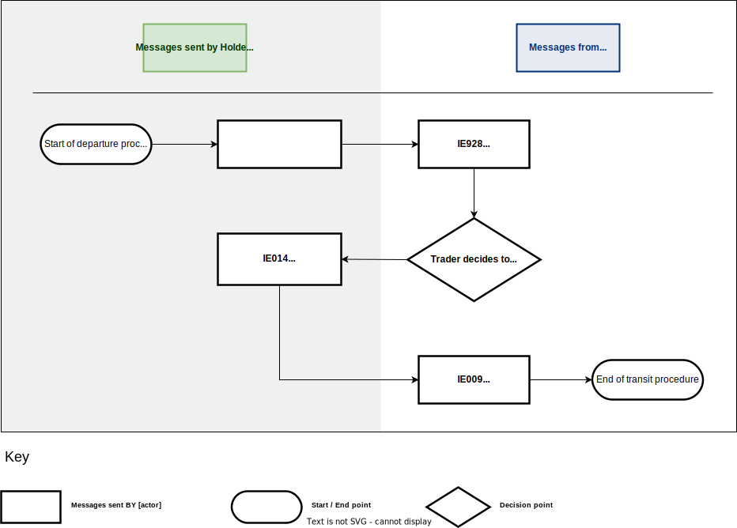

<a href="../figures/cancel_pre-lodge_dec.svg" target="_blank">Open the diagram in a new tab.</a>

1. The process starts when the holder of the transit procedure submits the ‘Declaration Data’ E_DEC_DAT (IE015) message to the office of departure with ‘Additional Declaration Type’ equal to ‘D’.
1. The office of departure validates this message successfully and sends the ‘Positive Acknowledgement’ E_POS_ACK (IE928) message to the holder of the transit procedure to acknowledge receipt of the transit declaration.
1. The holder of the transit procedure decides to cancel the pre-lodged declaration. 
1. The holder of the transit procedure sends the ‘Declaration Invalidation Request’ E_DEC_INV (IE014) message to the office of departure.
1. Assuming the ‘Declaration Invalidation Request’ E_DEC_INV (IE014) message is valid, the office of departure automatically sends a positive decision to cancel the pre-lodged declaration. The ‘Invalidation Decision’ E_INV_DEC (IE009) is sent to the holder of the transit procedure.
1. The transit movement ends.

## Departure message flows

### Standard departure 

**Applicable procedures:** normal and simplified.

This scenario outlines the basic standard transit procedure at departure when the goods are presented without delay by the holder of the transit procedure.

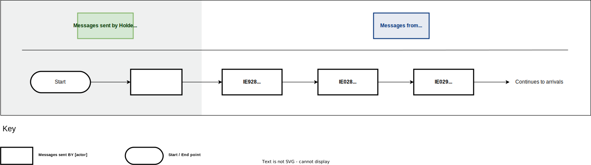

<a href="../figures/standard_departure.svg" target="_blank">Open the diagram in a new tab.</a>

1. The process starts when the holder of the transit procedure submits a transit declaration to the office of departure with the ‘Declaration Data’ E_DEC_DAT (IE015) message.
1. If the transit declaration is valid, the office of departure acknowledges the receipt of the transit declaration with the ‘Positive Acknowledgement’ E_POS_ACK (IE928) message.
1. The office of departure communicates the MRN to the holder of the transit procedure with the ‘MRN Allocated’ E_MRN_ALL (IE028) message.
1. The ‘Release for Transit’ E_REL_TRA (IE029) message is sent to the holder of the transit procedure.
1. The departure process ends.

### Rejection of transit declaration 

**Applicable procedures:** normal and simplified.

This scenario shows the case when the transit declaration is rejected.

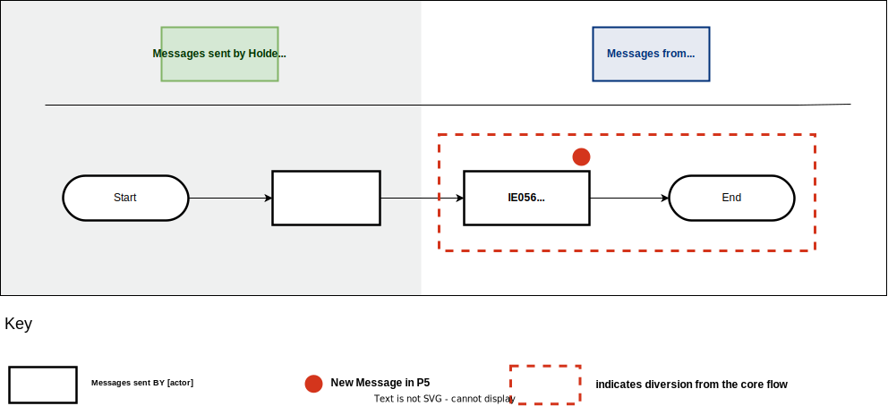

<a href="../figures/reject_transit_declaration.svg" target="_blank">Open the diagram in a new tab.</a>

1. The process starts when the holder of the transit procedure submits a transit declaration to the office of departure with the ‘Declaration Data’ E_DEC_DAT (IE015) message.
2. The office of departure validates the declaration data as invalid and thus rejects it by sending a response to the holder of the transit procedure the ‘Rejection from Office of Departure’ E_DEP_REJ (IE056) message.
3. The transit movement ends.

### Release for transit refused due to guarantee check failure 

**Applicable procedures:** normal and simplified.

This scenario involves the case when the release for transit is refused because the result of the guarantee check is not successful.

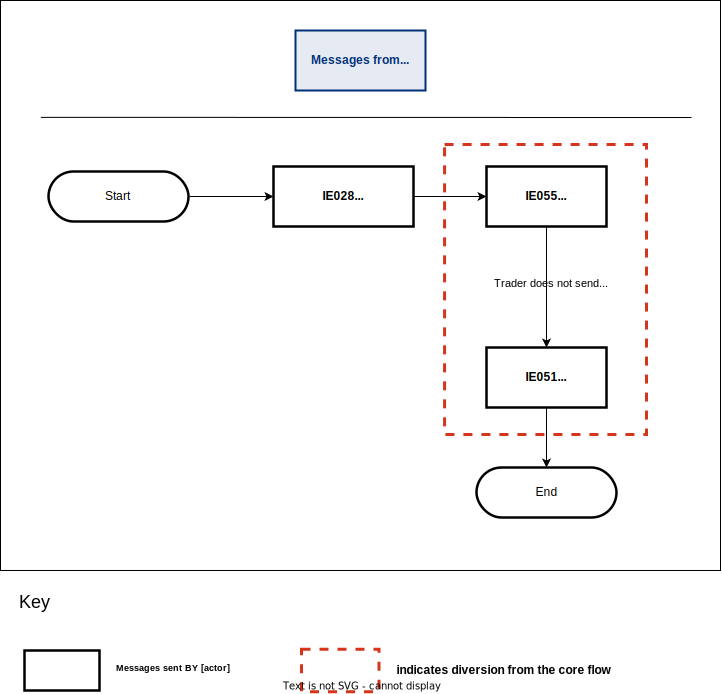

<a href="../figures/guarantee_registration_failure.svg" target="_blank">Open the diagram in a new tab.</a>

1. The process starts when an IE015 message is sent and an IE928 message is received by the holder of the transit procedure.
1. The office of departure communicates the MRN to the holder of the transit procedure with the ‘MRN Allocated’ E_MRN_ALL (IE028) message.
1. The holder of the transit procedure is notified that the declared guarantee is not valid with the ‘Guarantee Not Valid’ E_GUA_INV (IE055) message.
1. The holder of the transit procedure does not send a ‘Declaration Amendment’ E_DEC_AMD (IE013) within the allowed time period. 
1. The ‘No Release for Transit’ E_REL_NOT (IE051) message is sent to the holder of the transit procedure.
1. The transit movement ends.

### Release for transit refused for safety and security reasons 

**Applicable procedures:** normal and simplified.

This scenario involves the case when the release for transit is refused because of safety and security concerns.

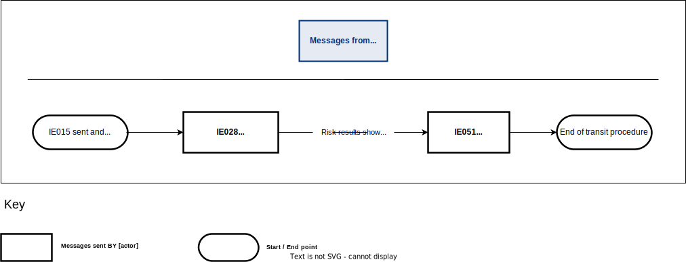

<a href="../figures/release_refused_safety_security.svg" target="_blank">Open the diagram in a new tab.</a>

1. The process starts when an IE015 message is sent and an IE928 message is received by the holder of the transit procedure.
1. The office of departure communicates the MRN to the holder of the transit procedure with the ‘MRN Allocated’ E_MRN_ALL (IE028) message.
1. A risk assessment of the transit declaration identifies a high risk with a threat to safety and security. 
1. The ‘No Release for Transit’ E_REL_NOT (IE051) message is sent to the holder of the transit procedure.
1. The transit movement ends.

### Declaration amendment accepted/rejected 

**Applicable procedures:** normal and simplified.

This scenario involves the cases when valid and invalid declaration amendments are made.

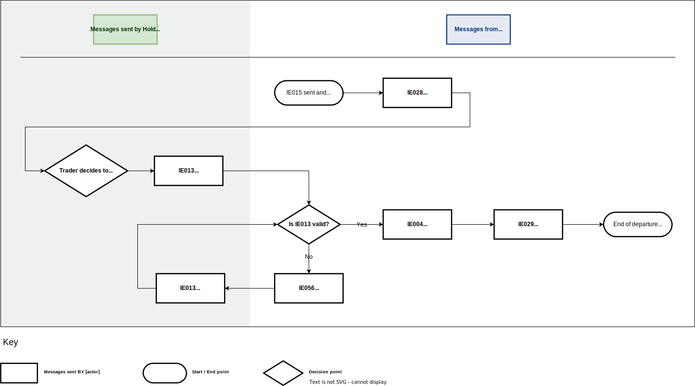

<a href="../figures/amendment_accepted_rejected.svg" target="_blank">Open the diagram in a new tab.</a>

1. The process starts when an IE015 message is sent and an IE928 message is received by the holder of the transit procedure.
1. The office of departure communicates the MRN to the holder of the transit procedure with the ‘MRN Allocated’ E_MRN_ALL (IE028) message.
1. The holder of the transit procedure notifies the office of departure of needed changes to the original declaration with a valid ‘Declaration Amendment’ E_DEC_AMD (IE013) before the goods have been released for transit.
1. The office of departure performs validation of the IE013 message with one of the following outcomes:
    - **No** (IE013 not valid): The office of departure sends the ‘Rejection from Office of Departure’ E_DEP_REJ (IE056) to the holder of the transit procedure. Go to step 3.
    - **Yes** (IE013 is valid): The office of departure sends its acceptance to the holder of the transit procedure with the ‘Amendment Acceptance’ E_AMD_ACC (IE004) message. Go to step 5.
1. The ‘Release for Transit’ E_REL_TRA (IE029) message is sent to the holder of the transit procedure.
1. The departure process ends.

### Cancellation request by the holder of the transit procedure before release for transit 

**Applicable procedures:** normal and simplified.

This scenario involves the case when the holder of the transit procedure makes a cancellation request before release for transit.

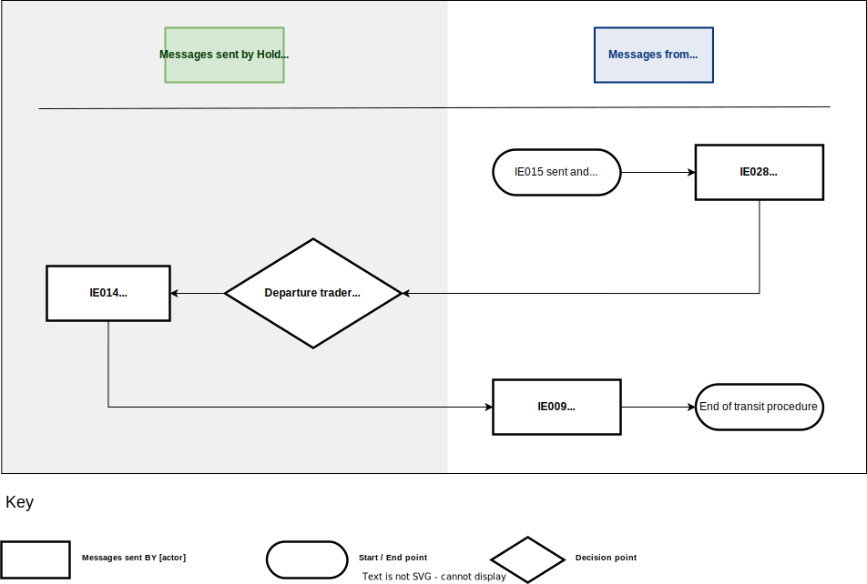

<a href="../figures/inval_request_before_release.svg" target="_blank">Open the diagram in a new tab.</a>

1. The process starts when an IE015 message is sent and an IE928 message is received by the holder of the transit procedure.
1. The office of departure communicates the MRN to the holder of the transit procedure with the ‘MRN Allocated’ E_MRN_ALL (IE028) message.
1. The holder of the transit procedure decides to cancel the transit declaration and therefore notifies the office of departure with the ‘Declaration Invalidation Request’ E_DEC_INV (IE014) message.
1. The office of departure examines the request and replies with the positive decision with the ‘Invalidation Decision’ E_INV_DEC (IE009) message (i.e. “Decision” is set to “1=Yes”).
1. The transit movement ends.

### Cancellation request by the holder of the transit procedure after release for transit 

**Applicable procedures:** normal and simplified.

This scenario involves the case when the holder of the transit procedure makes a cancellation request after release for transit.

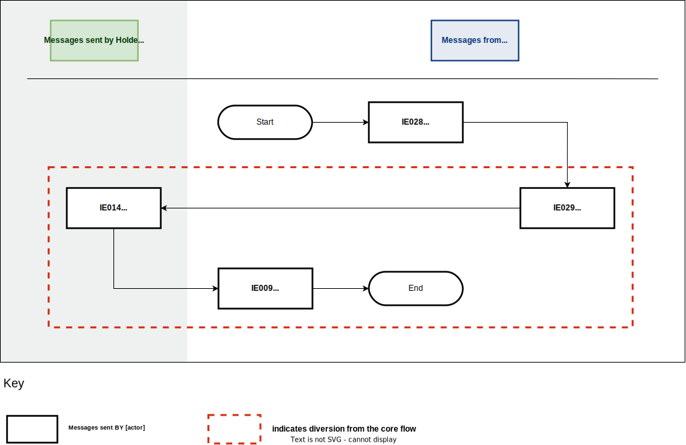

<a href="../figures/inval_request_after_release.svg" target="_blank">Open the diagram in a new tab.</a>

1. The process starts when an IE015 message is sent and an IE928 message is received by the holder of the transit procedure.
1. The office of departure communicates the MRN to the holder of the transit procedure with the ‘MRN Allocated’ E_MRN_ALL (IE028) message.
1. The ‘Release for Transit’ E_REL_TRA (IE029) message is sent to the holder of the transit procedure.
1. The holder of the transit procedure decides to cancel the transit declaration and therefore notifies the office of departure with the ‘Declaration Invalidation Request’ E_DEC_INV (IE014) message.
1. The office of departure automatically rejects the ‘Declaration Invalidation Request’ E_DEC_INV (IE014) by notifying the holder of the transit procedure with the ‘Rejection from Office of Departure’ E_DEP_REJ (IE056) message containing the error code ’92-Message out of sequence’.
1. The movement continues to arrivals.

### Cancellation of a transit declaration after release for transit  

**Applicable procedures:** normal and simplified.

This scenario involves the case when a transit declaration is cancelled by Border Force at the office of departure after the goods are released for transit.

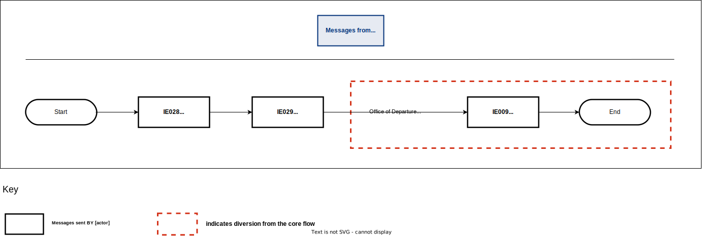

<a href="../figures/inval_declar_after_release.svg" target="_blank">Open the diagram in a new tab.</a>

1. The process starts when an IE015 message is sent and an IE928 message is received by the holder of the transit procedure.
1. The office of departure communicates the MRN to the holder of the transit procedure with the ‘MRN Allocated’ E_MRN_ALL (IE028) message.
1. The ‘Release for Transit’ E_REL_TRA (IE029) message is sent to the holder of the transit procedure.
1. The office of departure decides to cancel the declaration.
1. The ‘Invalidation Decision’ E_INV_DEC (IE009) is sent to the holder of the transit procedure.
1. The transit movement ends.

### Control by office of departure 

**Applicable procedures:** normal and simplified.

This scenario outlines what happens when the office of departure decides to initiate control on a transit movement.

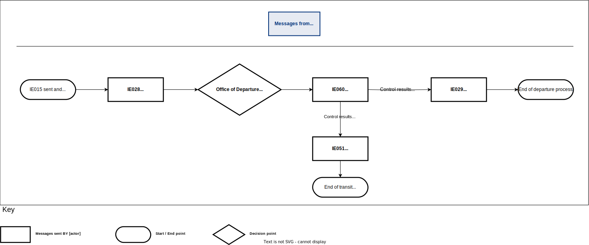

<a href="../figures/control_with_release.svg" target="_blank">Open the diagram in a new tab.</a>

1. The process starts when an IE015 message is sent and an IE928 message is received by the holder of the transit procedure.
1. The office of departure communicates the MRN to the holder of the transit procedure with the ‘MRN Allocated’ E_MRN_ALL (IE028) message.
1. The office of departure sends the ‘Control Decision Notification’ E_CTR_DEC (IE060) message to the holder of the transit procedure to notify about the upcoming control activities (having the data element TRANSIT OPERATION-Notification type equal to ‘0-Decision to Control (and requested documents if needed)’).
1. The control activity results in one of the following outcomes:
    - Control results are satisfactory. Go to step 5. 
    - Control results are unsatisfactory and the ‘No Release for Transit’ E_REL_NOT (IE051) message is sent to the holder of the transit procedure. The transit movement ends here.
1. The ‘Release for Transit’ E_REL_TRA (IE029) message is sent to the holder of the transit procedure.
1. The departure process ends.

## Arrival message flows

### Normal procedure at destination 

**Applicable procedures:** normal.

This scenario outlines the basic standard transit procedure at arrival.

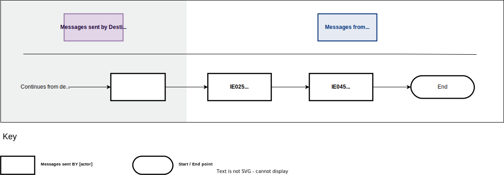

<a href="../figures/standard_arrival.svg" target="_blank">Open the diagram in a new tab.</a>

1. Upon arrival of the movement at the office of destination, the trader at destination announces it by submitting the ‘Arrival Notification’ E_ARR_NOT (IE007) message.
1. The goods are released from transit. The office of destination sends the ‘Goods Release Notification’ E_GDS_REL (IE025) message to the trader at destination.
1. The office of departure sends the ‘Write-Off Notification’ E_WRT_NOT (IE045) message to the holder of the transit procedure at departure.
1. The arrivals process ends.

### Simplified procedure at destination 

**Applicable procedures:** simplified.

This scenario outlines the scenario when the trader at destination sends an arrival notification E_ARR_NOT (IE007) message under simplified procedure.

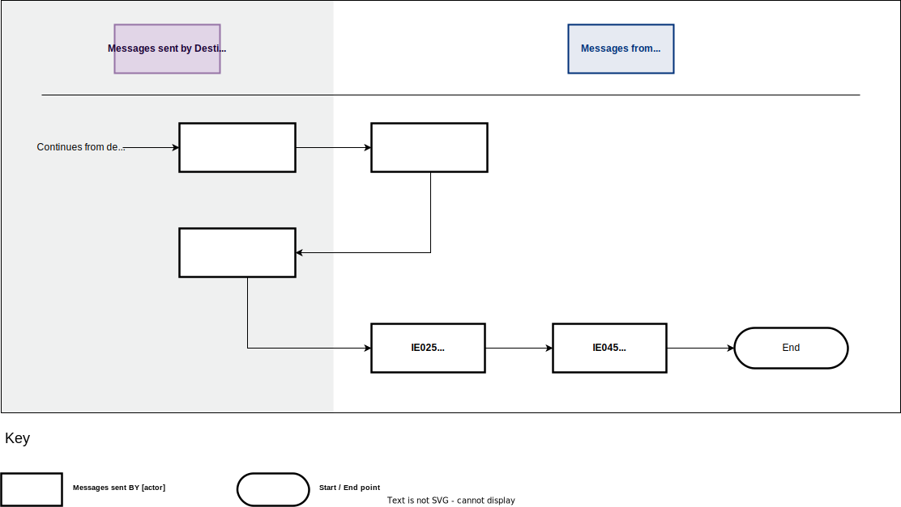

<a href="../figures/simplified_arrival.svg" target="_blank">Open the diagram in a new tab.</a>

1. Upon arrival of the movement at the office of destination, the trader at destination announces it by submitting the ‘Arrival Notification’ E_ARR_NOT (IE007) message under simplified procedure (simplified procedure flag = ‘Yes’).
1. The office of destination notifies the trader at destination that the unloading of the goods can be started by means of ‘Unloading Permission’ E_ULD_PER (IE043).
1. After unloading, the trader at destination sends the ‘Unloading Remarks’ E_ULD_REM (IE044) to the office of destination indicating that the unloading has been completed with no unloading remarks (i.e. the ‘Unloading Remarks’ E_ULD_REM (IE044) message contains the flags Unloading completion = ‘1-Yes’ & Conform = ‘1-Yes’).
1. The goods are released from transit. The office of destination sends the ‘Goods Release Notification’ E_GDS_REL (IE025) message to the trader at destination.
1. The office of departure sends the ‘Write-Off Notification’ E_WRT_NOT (IE045) message to the holder of the transit procedure at departure.
1. The arrivals process ends.

### Rejection of arrival notification 

This scenario outlines what happens when the arrival notification is not valid.

<a href="../figures/reject_arrival.svg" target="_blank">Open the diagram in a new tab.</a>

1. The trader at destination sends the ‘Arrival Notification’ E_ARR_NOT (IE007) to the office of destination. 
1. NCTS performs validation of this message. The following outcomes are possible:
    - **Yes** (the message is valid). Go to step 5.
    - **No** (the message is not valid). Go to step 3.
1. If the ‘Arrival Notification’ E_ARR_NOT (IE007) has been found to be invalid (that is, in terms of message structure and R/Cs), NCTS rejects it.
1. The office of destination notifies the trader at destination by sending the ‘Rejection from Office of Destination’ E_DES_REJ (IE057) message. Go to step 1.
1. If the ‘Arrival Notification’ E_ARR_NOT (IE007) has been found to be valid (i.e. in terms of message structure and R/Cs), NCTS accepts it.
1. The ‘Unloading Permission’ E_ULD_PER (IE043) message is sent to the authorised consignee to allow the unloading at the authorised place.
1. The authorised consignee sends the ‘Unloading Remarks’ E_ULD_REM (IE044) message to the office of destination.
1. The office of destination sends the ‘Goods Release Notification’ E_GDS_REL (IE025) message to the trader at destination in order to notify them that the transit procedure has ended successfully.
1. The office of departure sends the ‘Write-Off Notification’ E_WRT_NOT (IE045) message to the holder of the transit procedure.
1. The arrivals process ends.

### Unloading Permission Received - Unloading Remarks 

**Applicable procedures:** simplified.

This scenario outlines what happens when the authorized consignee sends the
unloading remarks E_ULD_REM (IE044) message.

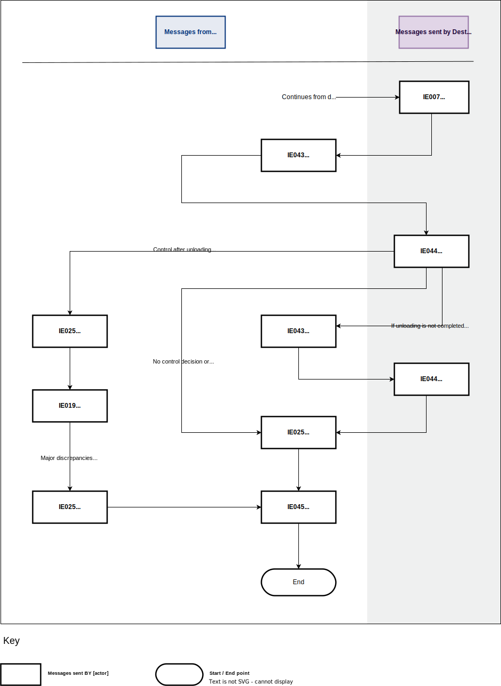

<a href="../figures/unload_perm_rec_remarks.svg" target="_blank">Open the diagram in a new tab.</a>

1. Upon arrival of the movement at the office of destination, the trader at destination announces it by submitting the ‘Arrival Notification’ E_ARR_NOT (IE007) message.
1. The ‘Unloading Permission’ E_ULD_PER (IE043) message is sent to the authorised consignee to allow the unloading at the authorised place.
1. The authorised consignee sends the ‘Unloading Remarks’ E_ULD_REM (IE044) message to the office of destination.
1. If no control is decided, or control results are satisfactory, go to step 7.
1. If control is performed at the office of destination and major discrepancies are reported into the destination control results: 
    1. The office of destination sends the ‘Goods Release Notification’ E_GDS_REL (IE025) message to the trader at destination.
    1. The office of departure notifies the holder of the transit procedure at departure that major discrepancies are reported in the destination control results with the ‘Discrepancies’ E_DIS_SND (IE019) message. Go to step 7.
1. If unloading is not completed and the office of destination decides to allow unloading to continue:
    1. The office of destination sends a new ‘Unloading Permission’ E_ULD_PER (IE043) message.
    1. The authorized consignee sends the ‘Unloading Remarks’ E_ULD_REM (IE044) message to the office of destination.
1. The office of destination sends the ‘Goods Release Notification’ E_GDS_REL (IE025) message to the trader at destination in order to notify them that the transit procedure has ended successfully.
1. The office of departure sends the ‘Write-Off Notification’ E_WRT_NOT (IE045) message to the holder of the transit procedure.
1. The arrivals process ends.

### Unloading remarks rejected 

**Applicable procedures:** simplified.

This scenario outlines what happens when the office of destination rejects an invalid unloading remarks message.

<a href="../figures/unload_remarks_reject.svg" target="_blank">Open the diagram in a new tab.</a>

1. Upon arrival of the movement at the office of destination, the trader at destination announces it by submitting the ‘Arrival Notification’ E_ARR_NOT (IE007) message under simplified procedure (simplified procedure flag = ‘Yes’).
1. The office of destination notifies the trader at destination that the unloading of the goods can be started by means of ‘Unloading Permission’ E_ULD_PER (IE043).
1. The trader at destination sends an ‘Unloading Remarks’ E_ULD_REM (IE044) message to the office of destination.
1. The office of destination checks the validity of the message. The following outcomes are possible:
    - **No** (message not valid): The office of destination rejects these remarks by sending back a ‘Rejection from Office of Destination’ E_DES_REJ (IE057) message. Go to step 3.
    - **Yes** (message is valid): Go to step 5. 
1. The office of destination sends the ‘Goods Release Notification’ E_GDS_REL (IE025) message to the trader at destination in order to notify them that the transit procedure has ended successfully.
1. The office of departure sends the ‘Write-Off Notification’ E_WRT_NOT (IE045) message to the holder of the transit procedure.
1. The arrivals process ends.

### Major discrepancies found during control at the office of destination

**Applicable procedures:** normal.

This scenario outlines how major discrepancies found during control at the office of destination are either resolved before expiration of the resolution timer or result in recovery.

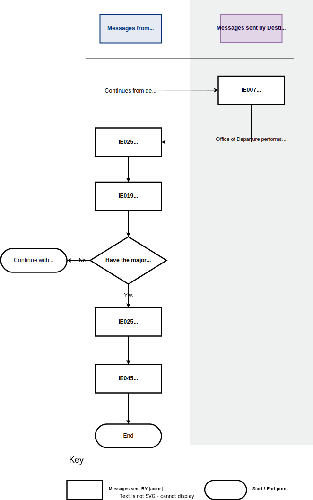

<a href="../figures/discrep_res_before_timer_expire.svg" target="_blank">Open the diagram in a new tab.</a>

1. Upon arrival of the movement at the office of destination, the trader at destination announces it by submitting the ‘Arrival Notification’ E_ARR_NOT (IE007) message.
1. The office of destination performs control and major discrepancies are reported.
1. The office of destination sends the ‘Goods Release Notification’ E_GDS_REL (IE025) message to the trader at destination.
1. The office of departure notifies the holder of the transit procedure at departure that major discrepancies are reported in the destination control results with the ‘Discrepancies’ E_DIS_SND (IE019) message.
1. The following outcomes are possible:
    - The major discrepancies are not resolved. Go to step 6.
    - The major discrepancies are resolved. Go to step 7.
1. The competent authority of recovery at departure notifies the holder of the transit procedure with the ‘Recovery Notification’ E_REC_NOT (IE035) message.
1. The office of destination sends the ‘Goods Release Notification’ E_GDS_REL (IE025) message to the trader at destination in order to notify them that the transit procedure has ended successfully.
1. The office of departure sends the ‘Write-Off Notification’ E_WRT_NOT (IE045) message to the holder of the transit procedure.
1. The arrivals process ends.

## Recovery message flows

### Recovery process

This scenario shows the recovery process for non-arrival of goods.

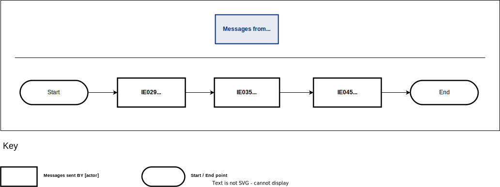

<a href="../figures/recovery_process.svg" target="_blank">Open the diagram in a new tab.</a>

1. The process starts when the ‘Release for Transit’ E_REL_TRA (IE029) message is sent to the holder of the transit procedure.
1. The competent authority of recovery at departure notifies the holder of the transit procedure with the ‘Recovery Notification’ E_REC_NOT (IE035) message.
1. The ‘Write-off Notification’ E_WRT_NOT (IE045) message is sent to the holder of the transit procedure.
1. The transit movement ends.

### Recovery initiation on incident occurrence

This scenario shows what happens when the competent authority of recovery at departure
decides to start recovery due to the occurrence of incidents during the journey of the transit
movement.

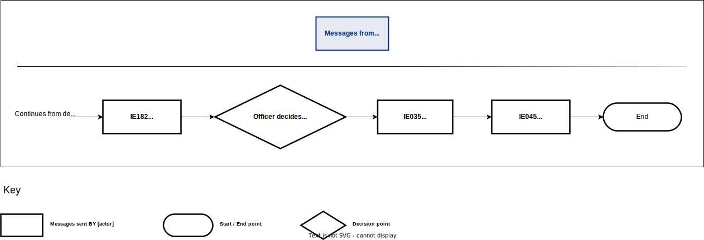

<a href="../figures/recovery_incident.svg" target="_blank">Open the diagram in a new tab.</a>

1. The process starts when the office of departure forwards the incident information to the holder of the transit procedure through the ‘Forwarded Incident Notification To ED’ E_INC_NOT (IE182) message.
1. The officer decides to update the system to recommend recovery due to suspicion of fraud or any other irregularity.
1. The competent authority of recovery at departure notifies the holder of the transit procedure with the ‘Recovery Notification’ E_REC_NOT (IE035) message.
1. The ‘Write-off Notification’ E_WRT_NOT (IE045) message is sent to the holder of the transit procedure.
1. The transit movement ends.

## Guarantee message flows

### Guarantee query check

This scenario shows how at any point in time, the holder of the transit procedure or the guarantor can make guarantee queries to the Guarantee Management System to check the details of their
own guarantees even though no MRN may have been allocated to the transit movement yet.

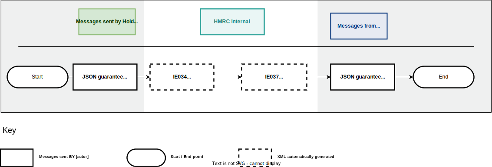

<a href="../figures/guarantee_check.svg" target="_blank">Open the diagram in a new tab.</a>

1. The holder of the transit procedure sends a JSON guarantee balance request. 
1. The JSON guarantee balance request is converted internally to an appropriate ‘Query on Guarantees’ E_GUA_QUE (IE034) message, which is sent to the Guarantee Management System. 
1. The Guarantee Management System replies back internally with the ‘Response Query on Guarantees’ E_GUA_RSP (IE037) message.
1. The ‘Response Query on Guarantees’ E_GUA_RSP (IE037) message is converted internally to a JSON guarantee balance response, which is sent to the holder of the transit procedure.

